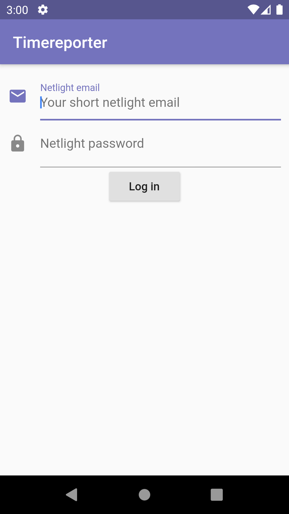

# Timereporter

**Standard disclaimer:**
This project is not an official app and comes with no warranties. Use at your own risk.

**Currently only supports Android.**

This is an app that allows Netlighters to timereport automatically. You log in using your Netlight credentials. Then you can choose to either report now, or schedule an automatic time report. The app will send the timereport each Thursday when set to automatic.

All your credentials are stored & encrypted locally. They will only be sent to the backend for processing, and is never stored elsewhere. 

Keep in mind that the backend is using a bot (web scraping) to click through the usual timereport UI for you. Hence, all operations are slow and can take time. However, you may safely close the app without interrupting any processes. 

  

